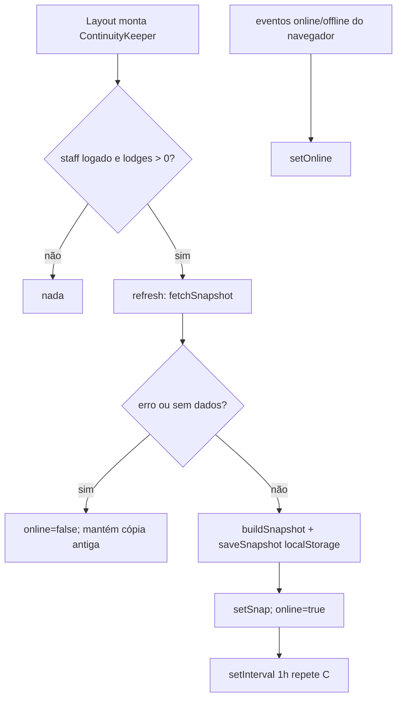
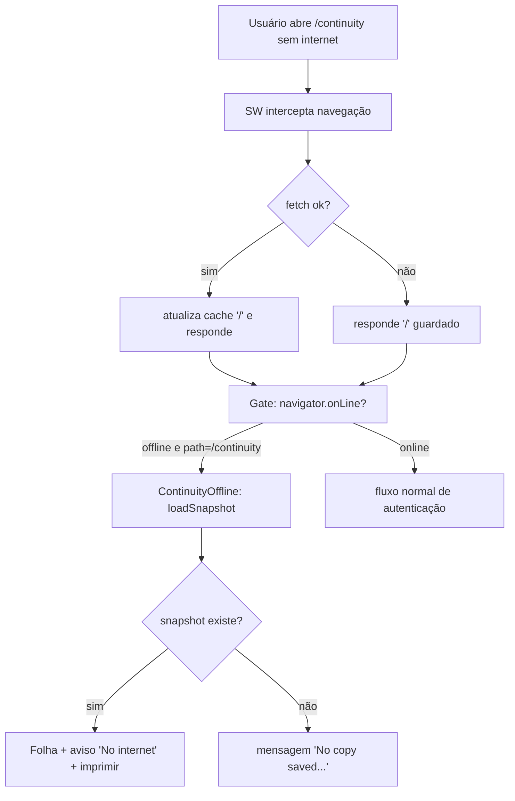
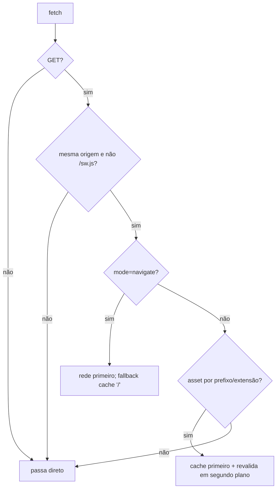

# Fluxogramas — continuidade-offline

## Atualização do snapshot 🟢 (`continuity.ts:57-78`)

```mermaid
flowchart TD
  A[Layout monta ContinuityKeeper] --> B{staff logado e lodges > 0?}
  B -- não --> Z[nada]
  B -- sim --> C[refresh: fetchSnapshot]
  C --> D{erro ou sem dados?}
  D -- sim --> E[online=false; mantém cópia antiga]
  D -- não --> F[buildSnapshot + saveSnapshot localStorage]
  F --> G[setSnap; online=true]
  G --> H[setInterval 1h repete C]
  I[eventos online/offline do navegador] --> J[setOnline]
```

## Abertura offline 🟢 (`App.tsx:45`, `sw.js:16-20`)

```mermaid
flowchart TD
  A[Usuário abre /continuity sem internet] --> B[SW intercepta navegação]
  B --> C{fetch ok?}
  C -- sim --> D[atualiza cache '/' e responde]
  C -- não --> E[responde '/' guardado]
  D --> F[Gate: navigator.onLine?]
  E --> F
  F -- offline e path=/continuity --> G[ContinuityOffline: loadSnapshot]
  F -- online --> H[fluxo normal de autenticação]
  G --> I{snapshot existe?}
  I -- sim --> J[Folha + aviso 'No internet' + imprimir]
  I -- não --> K[mensagem 'No copy saved...']
```

## Estratégia de fetch do SW 🟢 (`sw.js:11-30`)

```mermaid
flowchart TD
  R[fetch] --> M{GET?}
  M -- não --> P[passa direto]
  M -- sim --> O{mesma origem e não /sw.js?}
  O -- não --> P
  O -- sim --> N{mode=navigate?}
  N -- sim --> NF[rede primeiro; fallback cache '/']
  N -- não --> A{asset por prefixo/extensão?}
  A -- sim --> CF[cache primeiro + revalida em segundo plano]
  A -- não --> P
```
