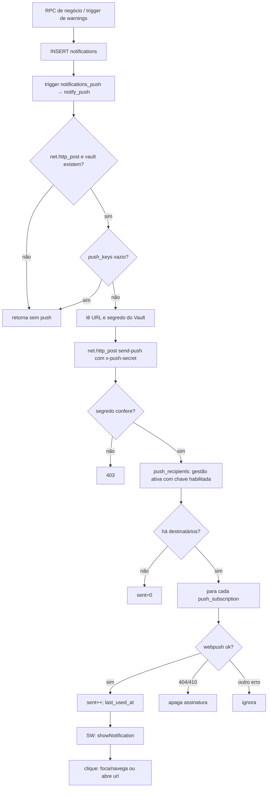
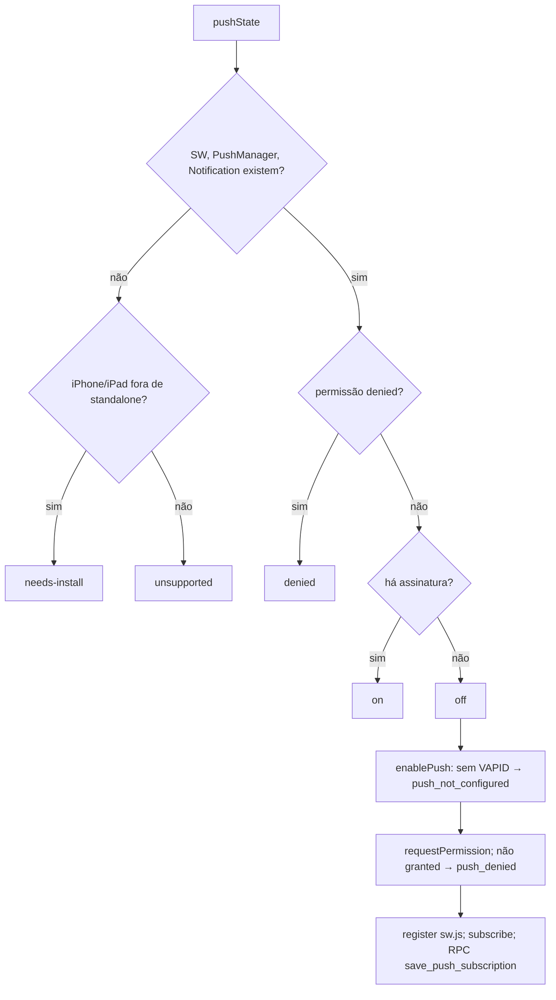
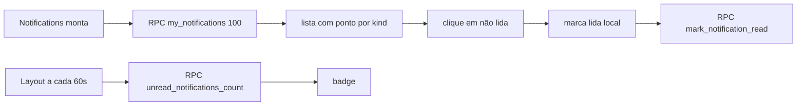

# Fluxogramas — notificacoes-e-push

## Geração e entrega 🟢

```mermaid
flowchart TD
  A[RPC de negócio / trigger de warnings] --> B[INSERT notifications]
  B --> C[trigger notifications_push → notify_push]
  C --> D{net.http_post e vault existem?}
  D -- não --> Z[retorna sem push]
  D -- sim --> E{push_keys vazio?}
  E -- sim --> Z
  E -- não --> F[lê URL e segredo do Vault]
  F --> G[net.http_post send-push com x-push-secret]
  G --> H{segredo confere?}
  H -- não --> X[403]
  H -- sim --> I[push_recipients: gestão ativa com chave habilitada]
  I --> J{há destinatários?}
  J -- não --> K[sent=0]
  J -- sim --> L[para cada push_subscription]
  L --> M{webpush ok?}
  M -- sim --> N[sent++; last_used_at]
  M -- 404/410 --> O[apaga assinatura]
  M -- outro erro --> P[ignora]
  N --> Q[SW: showNotification]
  Q --> R[clique: foca/navega ou abre url]
```

## Ativar push no aparelho 🟢 (`push.ts:19-41`)

```mermaid
flowchart TD
  S[pushState] --> T{SW, PushManager, Notification existem?}
  T -- não --> U{iPhone/iPad fora de standalone?}
  U -- sim --> V[needs-install]
  U -- não --> W[unsupported]
  T -- sim --> X{permissão denied?}
  X -- sim --> Y[denied]
  X -- não --> Z{há assinatura?}
  Z -- sim --> ON[on]
  Z -- não --> OFF[off]
  OFF --> E1[enablePush: sem VAPID → push_not_configured]
  E1 --> E2[requestPermission; não granted → push_denied]
  E2 --> E3[register sw.js; subscribe; RPC save_push_subscription]
```

## Leitura na central 🟢

```mermaid
flowchart LR
  A[Notifications monta] --> B[RPC my_notifications 100]
  B --> C[lista com ponto por kind]
  C --> D[clique em não lida]
  D --> E[marca lida local] --> F[RPC mark_notification_read]
  G[Layout a cada 60s] --> H[RPC unread_notifications_count] --> I[badge]
```
